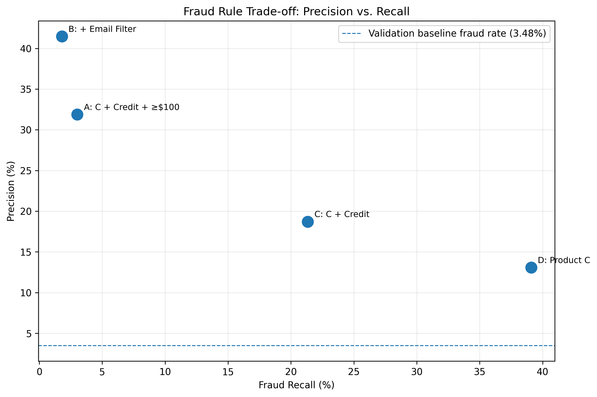

# Fraud Strategy Case Study

## Balancing Fraud Prevention, Customer Friction, and Growth

This project analyzes a large e-commerce transaction dataset to identify fraud patterns and evaluate different fraud prevention strategies.

The goal was not simply to predict fraud. I approached the problem from an operations perspective:

> How can a platform reduce fraud while minimizing unnecessary friction for legitimate customers?

The analysis uses SQL, DuckDB, Python, and transaction-level fraud data.

---

## Business Problem

Fraud teams face a fundamental trade-off.

Broad rules catch more fraud but can block large numbers of legitimate transactions. Narrow rules reduce customer friction but may allow substantial fraud to pass through.

I analyzed transaction behavior to identify high-risk segments and tested several rule-based interventions.

The analysis focuses on three business metrics:

- **Precision:** Of the transactions we flag, how many are actually fraudulent?
- **Recall:** How much of total fraud do we catch?
- **Customer friction:** How many legitimate transactions are unnecessarily flagged?

---

## Key Finding

No single rule dominates across all objectives.

More targeted rules produced substantially higher precision, but their fraud coverage declined sharply.

| Rule | Precision | Fraud Recall |
|---|---:|---:|
| Product C | 13.08% | 39.10% |
| Product C + Credit | 18.71% | 21.34% |
| Product C + Credit + ≥$100 | 31.87% | 3.02% |
| + Selected Email Domains | 41.48% | 1.79% |

This creates a clear operational trade-off between **fraud coverage and customer friction**.



---

## Fraud Strategy

Rather than deploying one universal blocking rule, the results suggest a tiered intervention strategy.

### High-risk transactions
Use stronger interventions such as transaction holds or additional verification.

### Medium-risk transactions
Introduce step-up verification rather than immediately declining the transaction.

### Lower-risk transactions
Allow the transaction while continuing to monitor behavioral signals.

This approach allows the platform to manage fraud risk without treating every suspicious transaction the same way.

---

#### Business Impact Analysis

Fraud detection performance alone does not determine the best strategy. I translated the rule-level results into a simple business impact framework that accounts for:

- expected fraud prevented
- customer friction from legitimate transactions being flagged
- operational cost of reviewing or intervening on transactions

Under the base-case assumptions, the estimated net benefit was:

| Rule | Estimated Net Benefit |
|---|---:|
| C: Product C + Credit | $18,905.50 |
| A: Product C + Credit + Amount >= $100 | $17,015.66 |
| B: + Selected Email Domains | $10,289.49 |
| D: Product C | -$1,594.13 |

The broad Product C rule captures substantially more fraud, but the cost of flagging legitimate customers outweighs the additional fraud prevented under the base-case assumptions.

### Sensitivity Analysis

The optimal rule changes depending on how costly customer friction is assumed to be:

| Customer Friction Scenario | Preferred Rule | Estimated Net Benefit |
|---|---|---:|
| Low friction | D: Product C | $39,703.87 |
| Base case | C: Product C + Credit | $18,905.50 |
| High friction | A: Product C + Credit + Amount >= $100 | $15,305.66 |

This suggests that fraud strategy should not rely on a single universal threshold. The appropriate intervention depends on both fraud risk and the business cost of disrupting legitimate customers.

### Recommendation

Use a tiered intervention strategy:

- **Low risk:** Approve the transaction.
- **Medium risk:** Apply step-up verification.
- **High risk:** Hold the transaction or require additional verification.
- **Very high risk:** Decline or route for manual review.

The objective is not simply to maximize fraud caught. It is to maximize expected business value while protecting legitimate customer experience. 


Why Precision Alone Is Misleading

The most precise rule in the analysis achieved approximately **41% precision**, but captured less than **2% of total fraud**.

Conversely, the broad Product C rule captured approximately **39% of fraud**, but most transactions it flagged were legitimate.

The operational question therefore isn't:

> "Which rule has the highest fraud rate?"

It is:

> "Which intervention produces the best trade-off between fraud prevented, legitimate customer friction, and business value?"

---

## Validation

Rules were developed using an earlier portion of the transaction data and evaluated on a later holdout period.

The overall fraud rate remained stable:

- Development period: **3.51%**
- Validation period: **3.48%**

The validation results show that the major fraud patterns persisted out-of-sample, although precision and recall varied substantially across rule definitions.

---

## Tools

- SQL
- DuckDB
- Python
- Pandas
- Matplotlib

---

## Repository Structure

```text
DoorDash_Fraud_Project/
├── data/
├── sql/
│   ├── 03_rule_evaluation.sql
│   └── 04_validation_analysis.sql
├── src/
│   └── create_charts.py
├── outputs/
│   ├── rule_evaluation.csv
│   └── validation_results.csv
├── charts/
│   ├── precision_vs_recall.png
│   ├── fraud_vs_legitimate_flagged.png
│   └── fraud_value_caught.png
└── README.md
